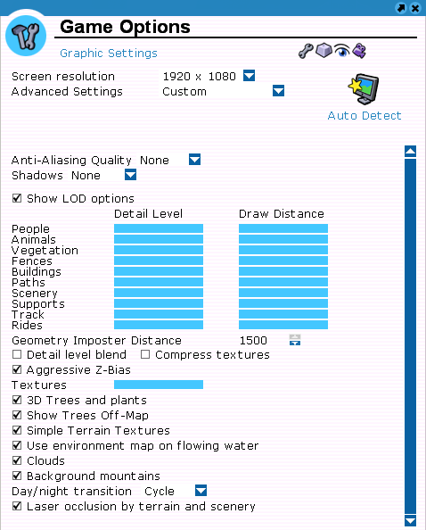

# RollerCoaster Tycoon 3 Complete Edition Remix Mod

Welcome to the RollerCoaster Tycoon 3 Complete Edition Remix Mod! This exciting mod aims to enhance the classic RollerCoaster Tycoon 3 experience by incorporating various improvements and new features. Join our passionate community of modders and enthusiasts as we work together to breathe new life into this beloved simulation game.

## Key Features

- **Enhanced Graphics**: Enjoy updated visuals and textures that bring the RollerCoaster Tycoon 3 world to life in stunning detail with RTX-Remix.

## Installation Guide

Follow these step-by-step instructions to install the RollerCoaster 3 Remix Mod:

1. **Backup Your Game Files**: Before proceeding, it's essential to create a backup of your existing RollerCoaster Tycoon 3 game files to ensure a safe and reversible installation process.

2. **Download the Mod**: Visit the official RollerCoaster 3 Remix Mod repository and download the latest version of the mod.

3. **Install the Mod**: Extract the downloaded mod files to your RollerCoaster Tycoon 3 game directory. This is typically located at `C:\Program Files (x86)\Steam\steamapps\common\RollerCoaster Tycoon 3 Complete Edition`.

4. **Launch the Game**: Start the game and enjoy the enhanced RollerCoaster Tycoon 3 experience with the RollerCoaster 3 Remix Mod installed.

5. **Adjust the Settings**: Following the guide screenshot below to adjust the game settings.

## Community and Contributions

We welcome and appreciate contributions from the RollerCoaster Tycoon 3 modding community. If you have suggestions, bug reports, or improvements for the RollerCoaster 3 Remix Mod, please feel free to submit them through the official project repository.

To maintain a positive and constructive environment, we ask that all contributors adhere to the following guidelines:

- **Respectful Communication**: Treat fellow community members with kindness and consideration.
- **Constructive Feedback**: Provide clear and helpful feedback to assist in the development of the mod.
- **Collaboration**: Work together with the project team and other contributors to enhance the mod.
- **Responsible Reporting**: Report any issues or bugs accurately and with relevant information.

## Stay Connected

Keep up with the latest updates and news about the RollerCoaster 3 Remix Mod through the following channels:

- **RTX-Remix Discord Channel**: [Join here](https://discord.gg/rtxremix)
- **GTASA Remix Discord Group**: [Join here](https://discord.com/channels/1028444667789967381/1226091998767743049) (Requires joining the RTX-Remix Discord channel first).

We're excited to have you join the RollerCoaster 3 Remix Mod community. Together, let's create an unforgettable park-building experience!
